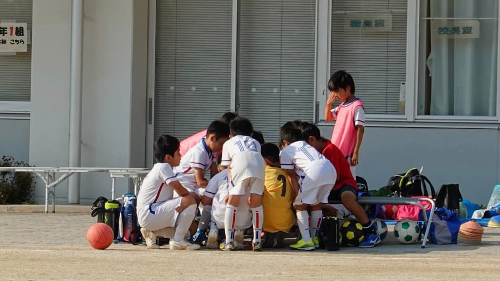

## 日時・会場

2021年5月30日（日）16:00キックオフ   
8人制20分ハーフ   
第二葛西小学校

|  対戦相手       | スコア|   | 得点者  |
| :--------------|:----:|:-:|:--------|
| FC北野         | 2-3 （前半1-3) | × |けいご、とうた|
| サンエフ葛西SC  | 4-1 (前半2-0) | ○ |とうた、じん、ちひろ、そう|

関係者の皆様、ありがとうございました。
