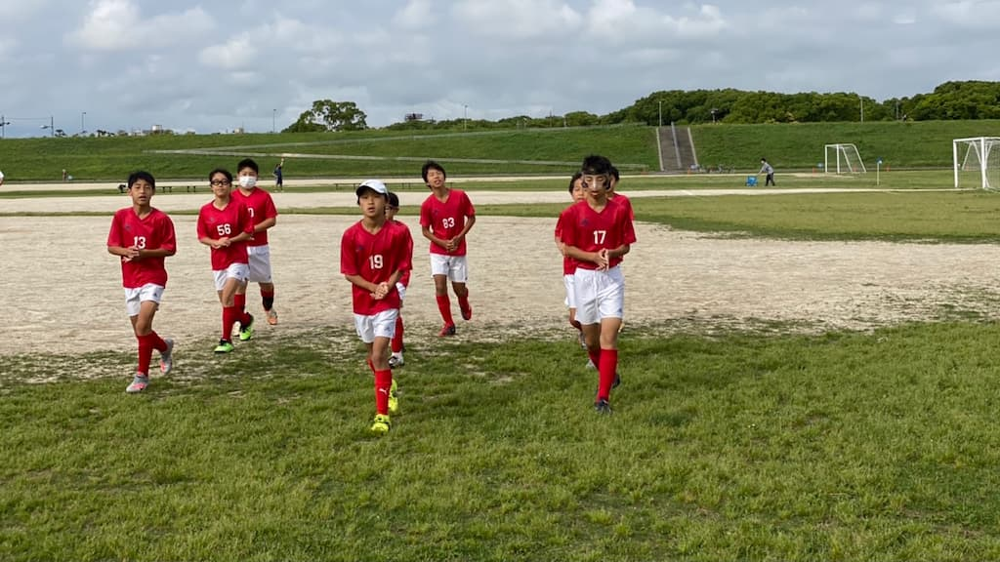

## 日時・会場

2021年6月5日（土）08:00キックオフ（8人制15分）  
篠崎グランド ロ面

### 南千住サッカー広場

| No.| スコア |   | 得点者  |
|:--:|:------:|:-:|:--------|
| 1  | 0-1      | × |-        |
| 2  | 3-0      | ○ |しゅうと  |
| 3  | 1-0      | ○ |しゅうと  |
| 4  | 2-0      | ○ |そうた2   |
| 5  | 2-0      | ○ |そうた、まさと|

### レストFC

| No.| スコア |   | 得点者  |
|:--:|:------:|:-:|:--------|
| 1  | 0-3      | × |-      |
| 2  | 0-3      | × |-      |
| 3  | 1-2      | × |そうた  |
| 4  | 0-5      | × |-      |

関係者の皆様、ありがとうございました。

