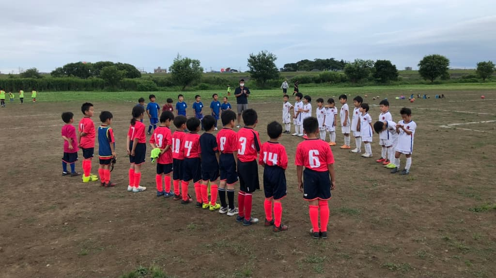

## 日時・会場

2021年6月5日（土）14:00キックオフ  
7人制10分  
@江戸川運動公園サッカー場

#### FCアスリート

| No.| スコア |   | 得点者  |
|:--:|:------:|:-:|:--------|
| 1  | 5-0    | ○ |よしなり,とものり,きよた,ゆうわ,まさと|
| 2  | 3-0    | ○ |わたる、きよた、りく|
| 3  | 1-0    | ○ |まさと |

#### 武蔵野FC

| No.| スコア |   | 得点者  |
|:--:|:------:|:-:|:--------|
| 1  | 2-0    | ○ |とものり,きよた|
| 2  | 3-0    | ○ |よしなり、ゆうわ、ゆうき  |

関係者の皆様、ありがとうございました。
