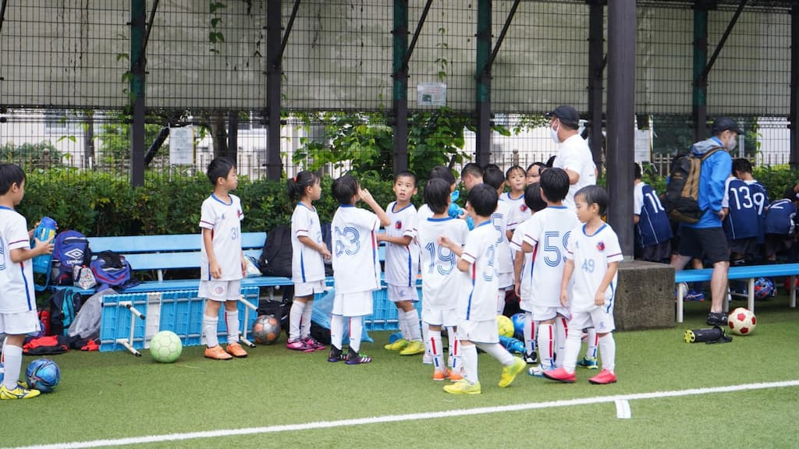

## 日時・会場

2021年7月4日（日）15:00キックオフ  
8人制15分ハーフ  
＠芝給水所公園G

### 御田SC

| スコア |   | 得点者  |
|:------:|:-:|:--------|
| 7-1 （前半4-0） | ○ |よしなり2、ゆうわ2、まさと、こうたろう、こうき|

### トレーニングマッチ

#### Aチーム

| No.| スコア |   | 得点者  |
|:--:|:------:|:-:|:--------|
| 1  | 2-0 | ○ |たかそう2|
| 2  | 4-0 | ○ |きよた2、なこ、たかそう|
| 3  | 2-0 | ○ |たかそう、わたる|
| 4  | 1-1 | △ |たかそう|

#### Bチーム

| No.| スコア |   | 得点者  |
|:--:|:------:|:-:|:--------|
| 1  | 1-2 | × |こうたろう|
| 2  | 2-1 | ○ |ゆうわ2|
| 3  | 3-0 | ○ |よしなり2、こうたろう|

御田SCの皆様、ありがとうございました。

