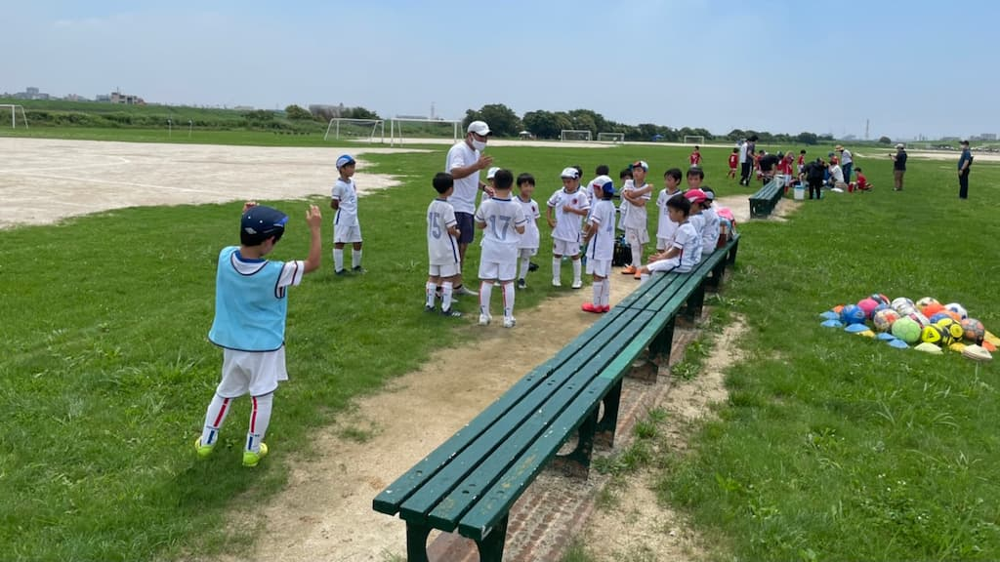

## 日時・会場

2021年7月10日（土）11:00キックオフ  
8人制15分ハーフ  
@篠崎グランド イ面

### Forzaリーグ

| 対戦相手| スコア |   | 得点者  |
|:----|:------:|:-:|:--------|
| ときわ台SC| 16-0 （前半9-0） | ○ |こうたろう5、ゆうき3、たける2、だい2、ゆうわ2、とものり、よしなり|

### トレーニングマッチ
9人制12分  

| No.| スコア |   | 得点者  |
|:--:|:------:|:-:|:--------|
| 1  | 2-1 | ○ |ひろ2|
| 2  | 3-0 | ○ |りく2、りお|

ときわ台SCの皆様、ありがとうございました。

