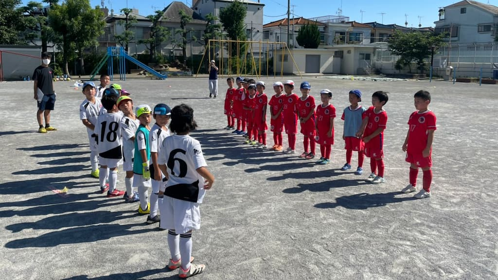

## 日時・会場

2021年7月17日（土）13:00キックオフ  
8人制15分ハーフ  
＠本一色小

### FC向島ユナイテッド

| スコア |   | 得点者  |
|:------:|:-:|:--------|
| 10-0 （前半4-0） | ○ |よしなり5、おうき3、こうたろう、ゆうわ|

### トレーニングマッチ

| No.| スコア |   | 得点者  |
|:--:|:------:|:-:|:--------|
| 1  | 5-0 | ○ |こうき2、りょうすけ、おうき、ひろ|
| 2  | 1-1 | ○ |こうたろう|
| 3  | 10-1 | ○ |ゆうわ3、こうたろう3、おうき2、こうき、OG|
| 4  | 1-2  | × |ひろ|
| 5  | 10-0|○ |こうたろう5、ゆうわ4、よしなり|

FC向島ユナイテッドの皆様、ありがとうございました。

