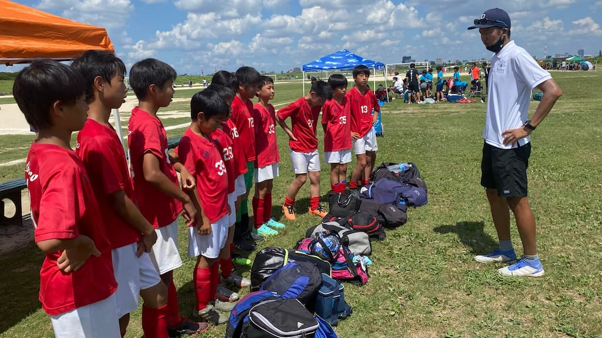

## 日時・会場

2021年7月25日（日）08:00キックオフ  
8人制15分  
＠篠崎グランド（ハ面）

### FC鬼高

| No.| スコア  |   | 得点者  |
|:--:|:------:|:-:|:--------|
| 1  | 0-0    | △ |-         |
| 2  | 2-1    | ○ |しゅうと2        |
| 3  | 5-0    | ○ |そうた2、ゆうのすけ2、しゅうと  |
| 4  | 0-1    | × |-      |
| 5  | 3-0    | ○ |しゅうと、そうた、ゆうのすけ      |
| 6  | 1-3    | × |れん     |
| 7  | 1-0    | ○ |OG     |

FC鬼高の皆様、ありがとうございました。
