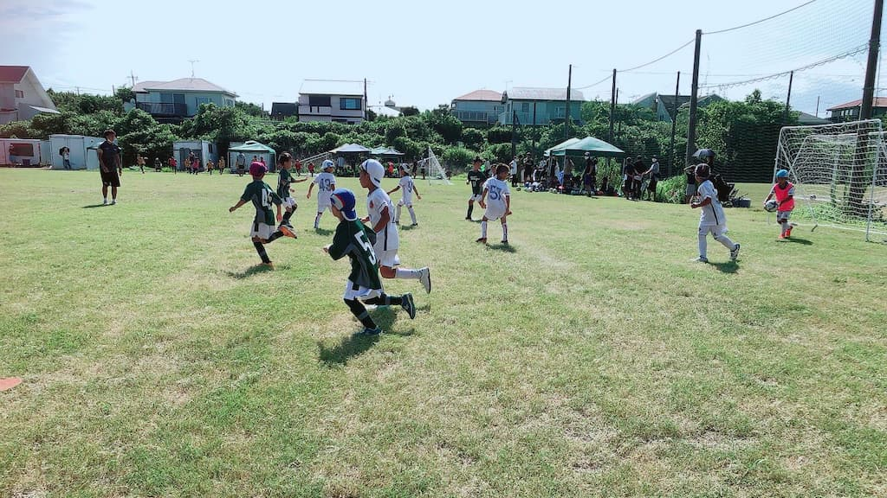

## 日時・会場

2021年7月29日（木）09:15キックオフ  
7人制15分ハーフ  
＠三笠山はなますG

### 予選リーグ

| 対戦相手| スコア |   | 得点者  |
|:----|:------:|:-:|:--------|
| フナジュク青 | 3-5 （前半1-4） | × |とものり、よしなり、こうたろう|
| レプロ| 4-4 （前半1-2） | △ |こうたろう2、たける、よしなり|
| ウィングス| 3-0 （前半1-0） | ○ |だい、よしなり、こうたろう|

### 下位トーナメント

| 対戦相手| スコア |   | 得点者  |
|:----|:------:|:-:|:--------|
| 鹿島アントラーズ | 8-2 （前半3-0） | ○ |ゆうき2、ゆうわ2、こうたろう2、だい、まさと|
| ウィングス | 2-4 （前半1-2） | × |こうたろう、まさと|

成績：6位/8チーム中  

関係者の皆様、ありがとうございました。
