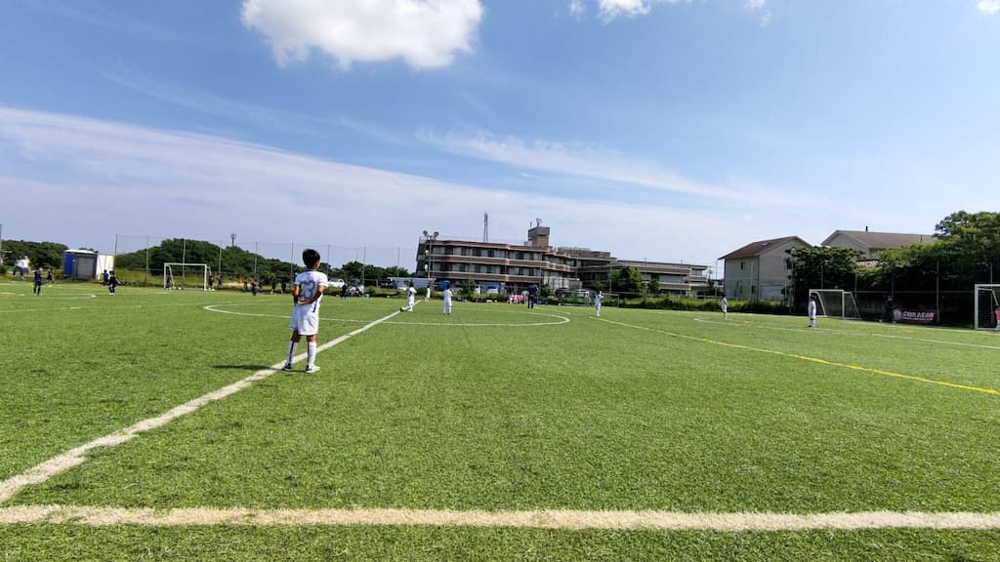

## 日時・会場

2021年5月30日（日）13:00キックオフ  
8人制10分  
@コラソングランド

#### Aチーム

| No.| スコア |   | 得点者  |
|:--:|:------:|:-:|:--------|
| 1  | 1-0       | ○ |たける  |
| 2  | 4-0       | ○|たける2、ゆうわ、だい|
| 3  | 0-2       | ×  |-               |

#### Bチーム

| No.| スコア |   | 得点者  |
|:--:|:------:|:-:|:--------|
| 1  | 0-1       | ×|- |
| 2  | 0-0       | △|- |
| 3  | 3-0       | ○ |こうたろう2、よしなり|

#### トップチーム

| No.| スコア |   | 得点者  |
|:--:|:------:|:-:|:--------|
| 1  | 2-0    | ○ |ゆうき、ゆうわ  |
| 2  | 1-2    | × |こうたろう|

#### サテライトチーム

| No.| スコア |   | 得点者  |
|:--:|:------:|:-:|:--------|
| 1  | 0-3    | × |-  |
| 2  | 0-3    | × |-  |

コラソン千葉の皆様、ありがとうございました。
