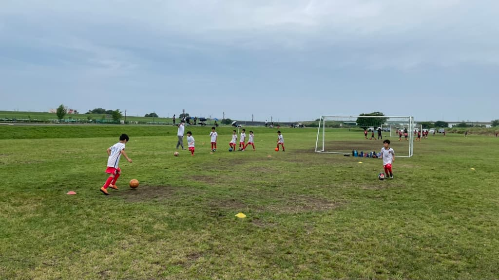

## 日時・会場

2021年6月6日（日）09:00キックオフ  
6人制12分  
@志木市秋ヶ瀬少年

#### トップチーム

| No.| スコア |   | 得点者  |
|:--:|:------:|:-:|:--------|
| 1  | 0-0    | △ |- |
| 2  | 0-3    | × |- |
| 3  | 0-3    | × |- |

#### サテライトチーム

| No.| スコア |   | 得点者  |
|:--:|:------:|:-:|:--------|
| 1  | 0-6    | × |- |
| 2  | 0-2    | × |- |
| 3  | 1-5    | × |なこ |

#### Aチーム

| No.| スコア |   | 得点者  |
|:--:|:------:|:-:|:--------|
| 1  | 0-2    | × |- |
| 2  | 0-0    | △ |- |
| 3  | 0-4    | × |- |
| 4  | 0-0    | △ |- |

#### Bチーム

| No.| スコア |   | 得点者  |
|:--:|:------:|:-:|:--------|
| 1  | 0-1    | × |- |
| 2  | 0-1    | × |- |
| 3  | 3-0    | ○ |よしなり、はるひと、ゆうわ|
| 4  | 0-1    | × |- |

FC大泉学園の皆様、ありがとうございました。
