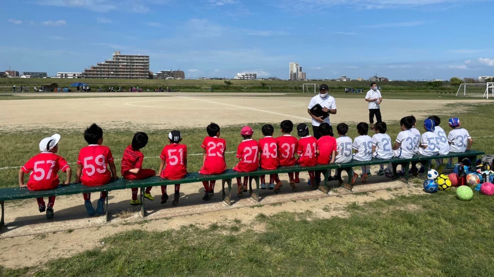

## 日時・会場

2021年6月12日（土）15:00キックオフ  
8人制15分  
@篠崎グランド イ面

#### Bチーム

##### リバティーFC

| スコア |   | 得点者  |
|:------:|:-:|:--------|
| 2-1(前半0-0)| ○ |ゆうわ、こうたろう|

#### Aチーム（FM）

##### 南千住サッカー広場

| スコア |   | 得点者  |
|:------:|:-:|:--------|
| 1-0(前半1-0)| ○ |とものり |

関係者の皆様、ありがとうございました。

