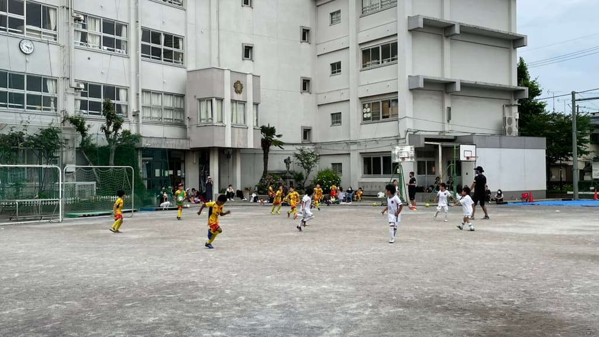

## 日時・会場

2021年6月26日（日）15:00キックオフ  
7人制12分  
@東小岩小

#### Aチーム

| No.| スコア  |   | 得点者  |
|:--:|:------:|:-:|:--------|
| 1  | 1-2    | × |きよた
| 2  | 2-1    | ○ |たける、わたる       |
| 3  | 4-1    | ○ |りく２、きよた、たける |
| 4  | 1-0    | ○ |たける       |
| 5  | 0-2    | × | |

#### Bチーム

| No.| スコア  |   | 得点者  |
|:--:|:------:|:-:|:--------|
| 1  | 3-0    | ○ |こうたろう2、よしなり        |
| 2  | 5-0    | ○ |よしなり4, こうたろう        |
| 3  | 3-0    | ○ |こうたろう2、よしなり       |
| 4  | 4-0    | ○ |よしなり、ゆうわ、まさと、OG|
| 5  | 4-1    | △ |まさと、ゆうわ、ひろ、こうき        |

渋谷東部JFCの皆様、ありがとうございました。

