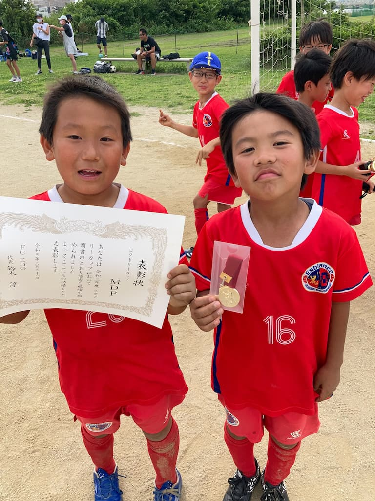

## 日時・会場

2021年6月26日（土）10:00キックオフ　 
＠葛飾区堀切橋フットサル場

### 予選リーグ　

7人制12分ハーフ

| 対戦相手| スコア |   | 得点者  |
|:----|:------:|:-:|:--------|
| 柴又KIDS| 4-0 | 〇 |かつき、れお、そらと、たかりん|
| たちばなSC| 2-1 | 〇 |こうけん、だい|

予選リーグBブロック1位通過

### 順位決定戦　

7人制15分ハーフ

| 対戦相手| スコア |   | 得点者  |
|:----|:------:|:-:|:--------|
| たちばなSC| 0-1 | × |-|
| FC.EDO| 1-1 （PK 3-2） | 〇 |ゆうき|

### 最終順位

3位（6チーム中）　

### 優秀選手賞

ひさじまかつき

### 優秀ディフェンス賞

にしやまたかりん

関係者の皆様、ありがとうございました。
