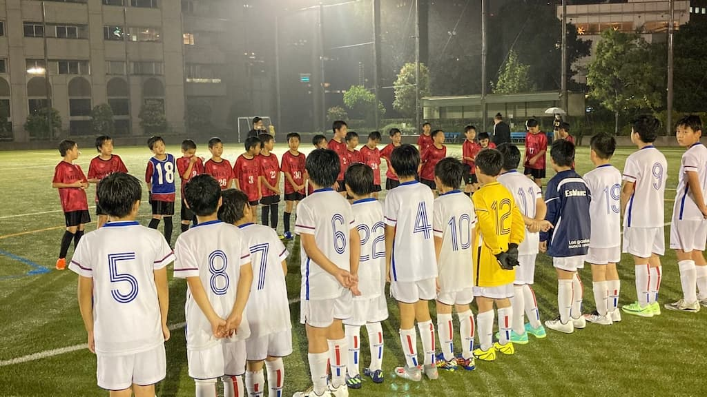

## 日時・会場

2021年7月4日（日）17:00キックオフ  
8人制15分ハーフ
＠芝給水所公園G

### 御田SC

| スコア |   | 得点者  |
|:------:|:-:|:--------|
| 2-0 （前半1-0） | ○ |ちひろ、けいご|

### フレンドリーマッチ

| No.| スコア |   | 得点者  |
|:--:|:------:|:-:|:--------|
| 1  | 0-0 | △ |-|
| 2  | 0-0 | ○ |-|
| 3  | 1-0 | ○ |まさのり|
| 4  | 5-1 | ○ |ちひろ2、しゅうと、じん、れいよう|
| 5  | 2-1 | ○ |とうた、りと|

御田SCの皆様、ありがとうございました。

