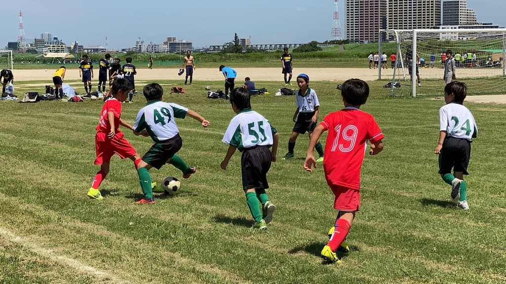

## 日時・会場

2021年7月17日（土）10:00キックオフ  
8人制15分ハーフ  
@篠崎グランド　イ面

### Forzaリーグ
| 対戦相手| スコア |   | 得点者  |
|:----|:------:|:-:|:--------|
| FC日暮里SC| 6-0 （前半3-0） | ○ |まさのり2，こうた、けいご3|

### フレンドリーマッチ

| No.| スコア |   | 得点者  |
|:--:|:------:|:-:|:--------|
| 1  | 0-4 | × |- |
| 2  | 0-1 | × |- |
| 3  | 0-0 | △ |- |
  
FC日暮里の皆様、ありがとうございました。

