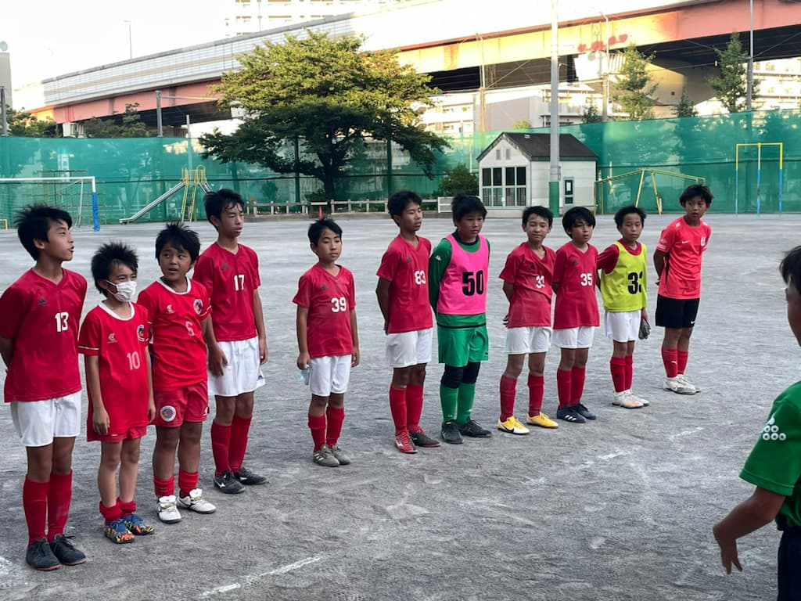

## 日時・会場

2021年7月22日（木）16:00キックオフ  
8人制15分  
＠小松川第２小学校

| No.| スコア |   | 得点者  |
|:--:|:------:|:-:|:--------|
| 1  | 0-0 | △ |- |
| 2  | 1-1 | △ |とうた |
| 3  | 1-1 | △ |とうた |
| 4  | 0-1 | × |-  |
| 5  | 0-1 | × |- |
| 6  | 1-0 | ○ |とうた|
| 7  | 1-0 | ○ |そうた |

江東フレンドリーの皆様、ありがとうございました。
