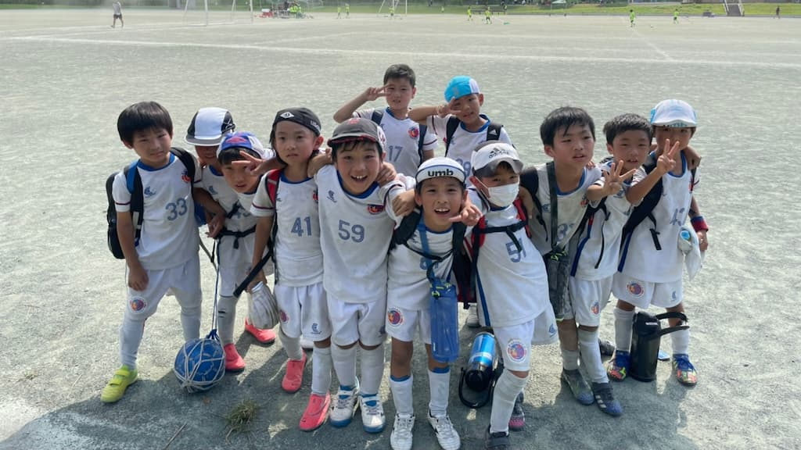

## 日時・会場

2021年7月24日（土）10:00キックオフ  
8人制12分ハーフ  
＠しらこばと多目的

### グループリーグ

| 対戦相手| スコア |   | 得点者  |
|:----|:------:|:-:|:--------|
| プライドFC B | 2-0 （前半2-0） | ○ |こうたろう2|
| FCグラーナ| 3-2 （前半1-1） | ○ |たける2、とものり|
| トリアネーロ町田| 2-5 （前半2-1） | × |こうたろう2|

### 3位決定戦

| 対戦相手| スコア |   | 得点者  |
|:----|:------:|:-:|:--------|
| FCキロンガ | 1-6 （前半1-2）| × |こうたろう|

成績：4位/8チーム中  

関係者の皆様、ありがとうございました。
