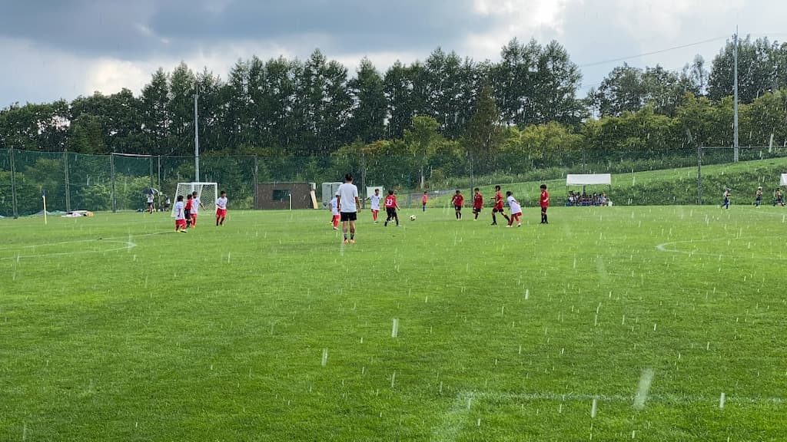

## 日時・会場

2021年7月31日（土）12:00キックオフ  
8人制15分ハーフ  
＠本白根第6グランド

### リーグ戦予選リーグ

| 対戦相手| スコア |   | 得点者  |
|:----|:------:|:-:|:--------|
| 杉十小| 0-5 （前半0-1） | × |- |
| 上州TIC| 2-4 （前半1-2） | × |きらと、こうた |
| あざみ野B| 3-2 （前半2-1） | ○ | はるき、きらと、こうた |
| GLOW | 0-8 （前半0-2） | × | - |
| TDFC | 0-12 （前半0-7） | × | - |
| あざみ野A | 0-16 （前半0-7） | × | - |

### トーナメント

| 対戦相手| スコア |   | 得点者  |
|:----|:------:|:-:|:--------|
| あざみ野B | 3-0 （前半3-0） | ○ |りょう2、しゅんけん|
| 上州TIC | 3-4 （雷のためPK戦に変更) | × |- |

成績：6位/7チーム中  

関係者の皆様、ありがとうございました。
