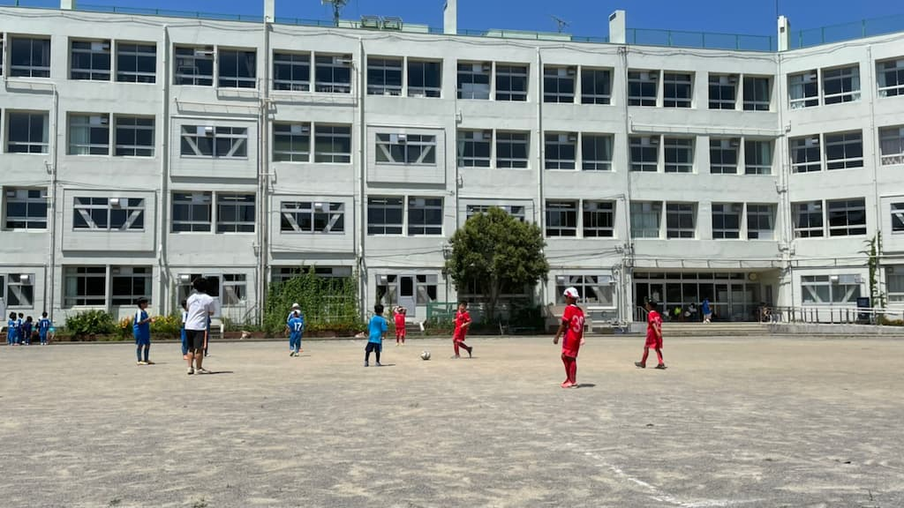

## 日時・会場

2021年8月1日（日）12:00キックオフ  
7人制12分  
＠総合教育センター

### Aチーム

| No.| スコア |   | 得点者  |
|:--:|:------:|:-:|:--------|
| 1  | 3-0 | ○ |だい2、たける|
| 2  | 9-0 | ○ |きよた4、たかそう3、たける、だい|
| 3  | 6-0 | ○ |きよた3、りく、なこ、たかそう|
| 4  | 1-1 | △ |たかそう|
| 5  | 0-1 | × ||
| 6  | 3-2 | ○ |ゆうき2、きよた|

### Bチーム

| No.| スコア |   | 得点者  |
|:--:|:------:|:-:|:--------|
| 1  | 2-0 | ○ |ゆうわ、おうき|
| 2  | 0-4 | × |-|
| 3  | 1-0 | ○ |ゆうわ|
| 4  | 3-1 | ○ |まさと2、よしなり|
| 5  | 2-0 | ○ |ゆうわ、まさと|

ジェファFCの皆様、ありがとうございました。
