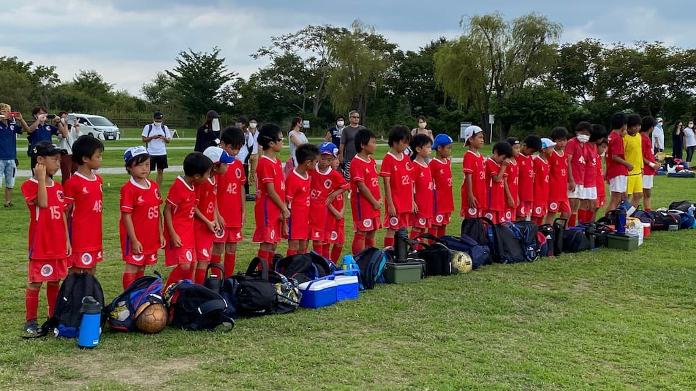

## 日時・会場

2021年8月12日（木）9:00キックオフ 
8人制15分 
@柴又球技場

### Aチーム（2、3年生混合）

| 対戦相手| スコア |   | 得点者  |
|:----|:------:|:-:|:--------|
| 柴又KIDS| 0-1 | × |-|
| T.K.フィッシャーズ| 0-2 | × |-|
| 柴又KIDS| 1-1 | △ |きよた|

### Bチーム（2、3年生混合）

| 対戦相手| スコア |   | 得点者  |
|:----|:------:|:-:|:--------|
| T.K.フィッシャーズ| 0-1 | × |-|
| 柴又KIDS| 1-6 | × |こうたろう|
| T.K.フィッシャーズ| 0-0 | △ |-|

### A・Bチーム（2、3年生混合）

| 対戦相手| スコア |   | 得点者  |
|:----|:------:|:-:|:--------|
| 柴又KIDS| 3-0 | 〇 |まさき、たける、はるひと|

T.K.フィッシャーズ、柴又KIDSの皆様、ありがとうございました。
