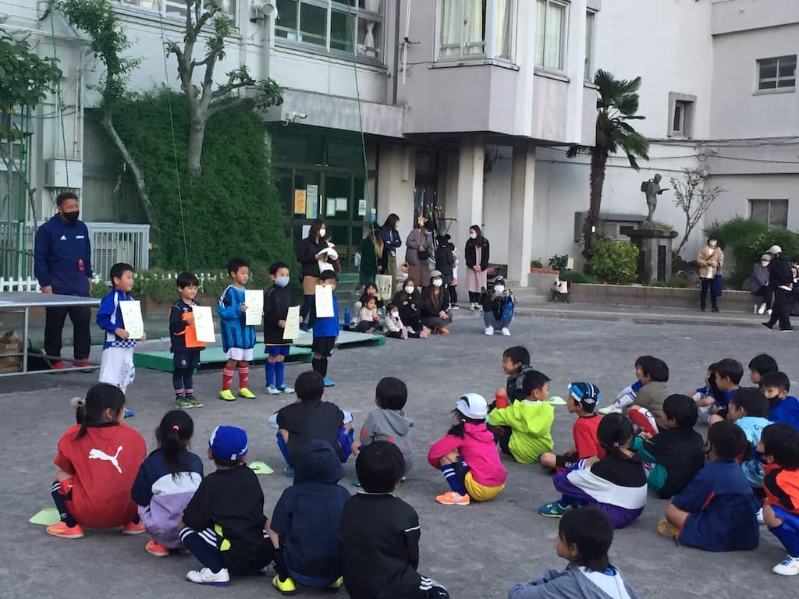

## 日時・会場

2021年10月24日（日）13:15キックオフ  
6人制10分ハーフ 
@東小岩小学校

### 予選リーグ

| 対戦相手| スコア |   | 得点者  |
|:----|:------:|:-:|:--------|
| ブルーイーグルス | 1-6 | × |そら|
| FC R.E.V | 1-5 | × |はると|
| 南千住サッカー広場 | 1-14 | × |そら|
| MIP FC | 0-11 | × |-|

### 順位決定戦

| 対戦相手| スコア |   | 得点者  |
|:----|:------:|:-:|:--------|
| FC R.E.V | 2-7 | × |そら2|

成績：5位/5チーム中

関係者の皆様、ありがとうございました。