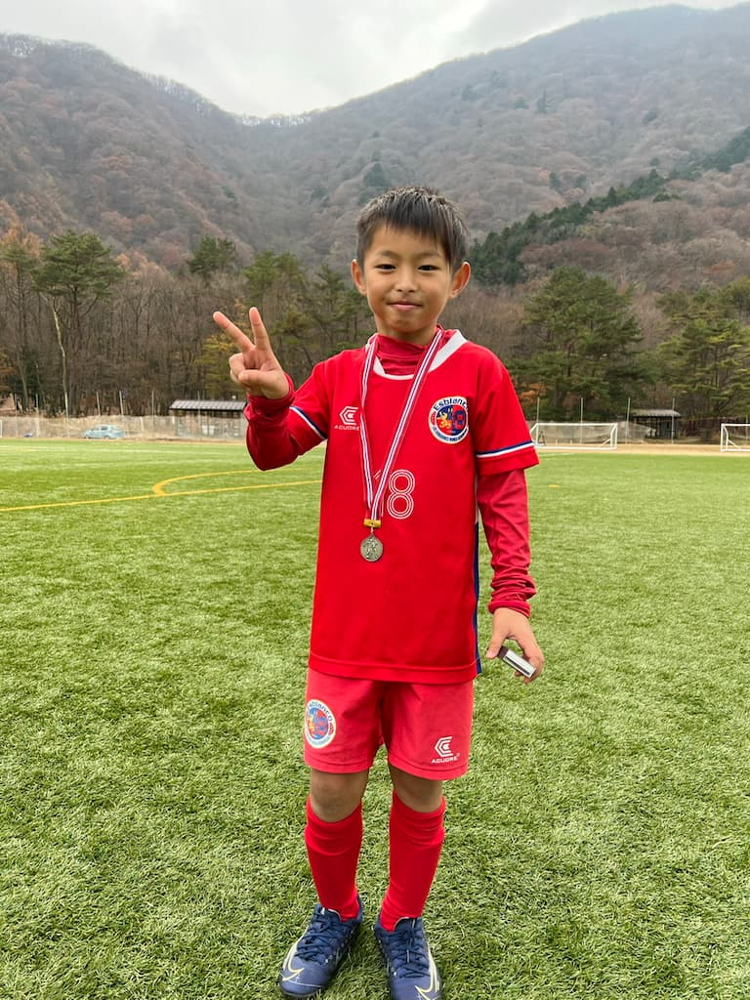

## 日時・会場

2021年11月20日（土）～2021年11月21日（日） 
8人制15分ハーフ 
@本栖湖スポーツセンター

### 予選リーグ戦（Bブロック）

| 対戦相手| スコア |   | 得点者  |
|:----|:------:|:-:|:--------|
| 府中新町FC A | 0-12 （前半0-7） | × |-|
| FC Waragoma | 2-3 （前半1-0） | × |こうたろう、ゆうわ|
| GROW FC B | 9-0 （前半1-0） | 〇 |りょう、OG、まさき3、はるひと2、ゆうわ2|
| FC PORTA B | 0-3 （前半0-1） | × |-|

### 順位決定リーグ戦（スペシャルリーグ）

| 対戦相手| スコア |   | 得点者  |
|:----|:------:|:-:|:--------|
| 府中新町FC B | 2-5 （前半0-3） | × |まさき、はるひと|
| GROW FC A | 0-0 | △ |-|
| GROW FC B | 4-0 （前半0-0） | 〇 |よしなり、こうたろう2、はるひと|
| LAZOS MITO | 0-3 （前半0-2） | × |-|

成績：9位/10チーム中 
チーム努力賞：たかやま　りょう

### トレーニングマッチ（12分ハーフ）

| No.| 対戦相手| スコア |   | 得点者  |
|:--:|:----|:------:|:-:|:--------|
| 1  | FC PORTA | 0-6 （前半0-3） | × |-|
| 2  | 府中新町FC | 0-13 （前半0-8） | × |-|
| 3  | FC PORTA | 0-2 | × |-|
| 4  | FC Waragoma | 2-1 （前半1-1） | 〇 |はるひと、れお|
| 5  | FC 多摩川Jr. | 0-3 （前半0-2） | × |-|
| 6  | FC Waragoma | 1-2 | × |かつき|
| 7  | GROW FC B | 4-0 （前半2-0） | 〇 |かつき2、れお2|

関係者の皆様、ありがとうございました。