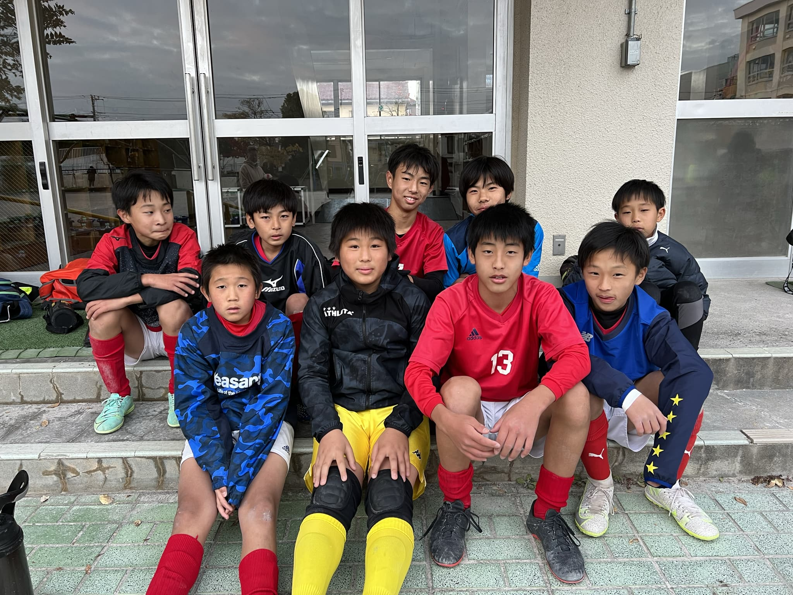

## 日時・会場

2021年12月5日（日）12:00キックオフ  
8人制20分ハーフ 
@南小岩第二小学校

| 対戦相手| スコア |   | 得点者  |
|:----|:------:|:-:|:--------|
| 大森キッカーズSC | 1-6 | × |ゆうのすけ|
| FC.PROUD | 5-2 | 〇 |しゅうと2、そうた2、ゆうのすけ|
| FCログロ | 1-2 | × |しゅうと|

成績：3位/4チーム中

関係者の皆様、ありがとうございました。