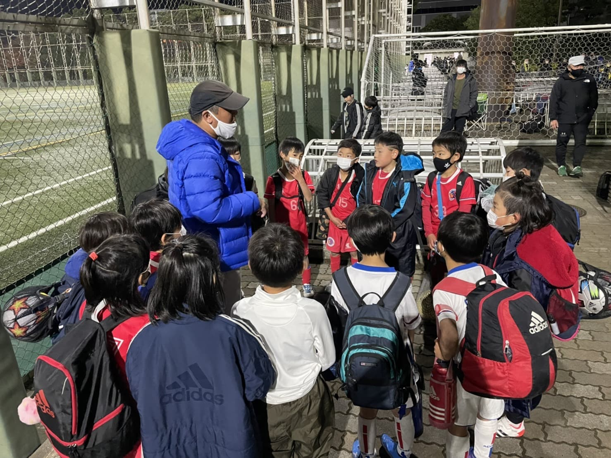

## 日時・会場

2021年12月11日（土）  
8人制10分ハーフ  
＠臨海球技場  

### Aチーム

#### えどそらFC 

| スコア |   | 得点者  |
|:------:|:-:|:--------|
| 0-1 |× | |

#### フレンドリーSC

| スコア |   | 得点者  |
|:------:|:-:|:--------|
| 0-0 |△ ||

### Bチーム

#### JUNS SC

| スコア |   | 得点者  |
|:------:|:-:|:--------|
| 5-0 |○ |こうたろう3、りょうすけ、ゆうわ|

#### 清新第三SCB

| スコア |   | 得点者  |
|:------:|:-:|:--------|
| 1-0 |○ |こうたろう|

関係者の皆様、ありがとうございました。
