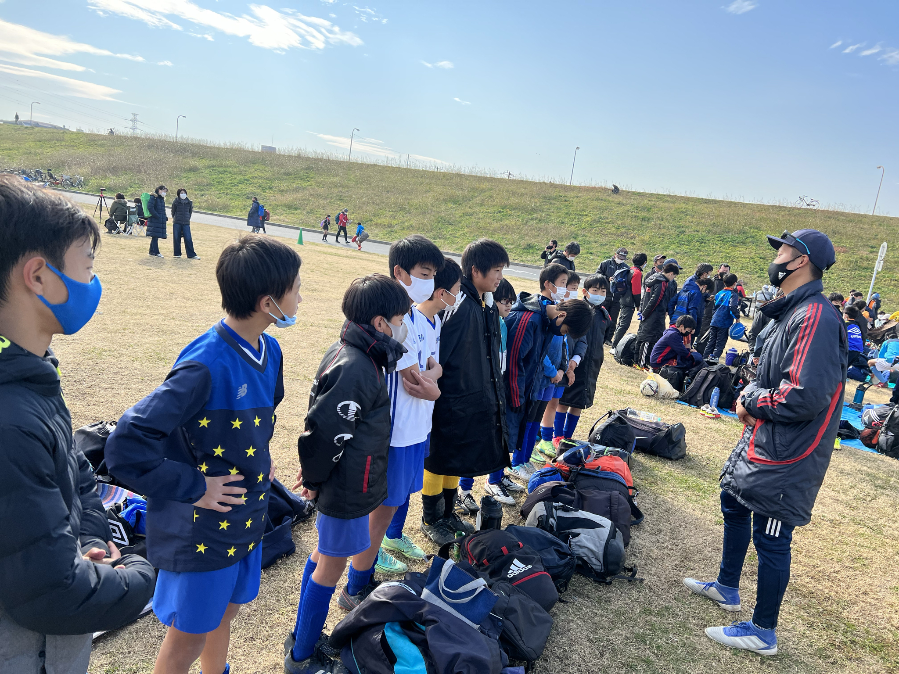

# 三井のリハウス東京都U-12ブロックリーグ（後期）

## 日時・会場

2021年12月12日（日）10:20キックオフ  
8人制20分ハーフ 
@柴又球技場（土手側）

### 第1節

| 対戦相手| スコア |   | 得点者  |
|:----|:------:|:-:|:--------|
| 金町SC | 0-0 | △ |-|

### 第2節

| 対戦相手| スコア |   | 得点者  |
|:----|:------:|:-:|:--------|
| FC北野 | 3-2 | 〇 |しゅうと、そうた2|

関係者の皆様、ありがとうございました。