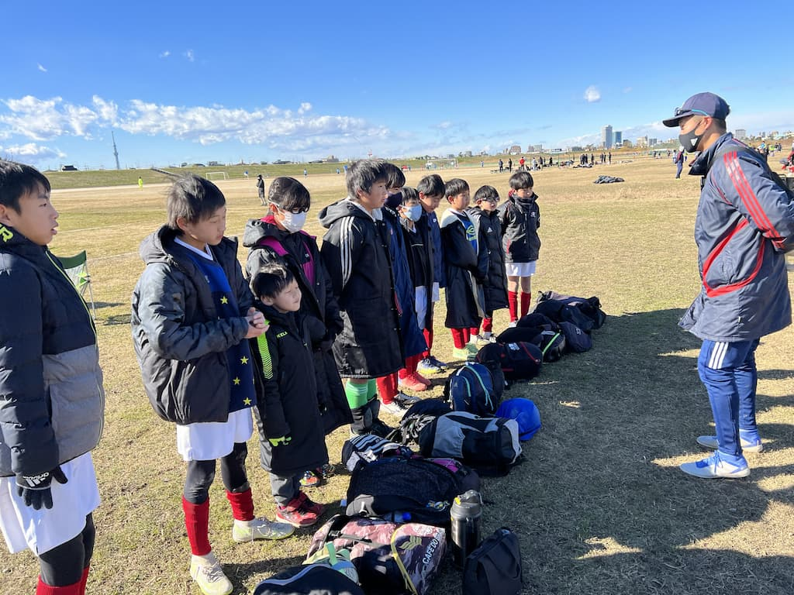

# 三井のリハウス東京都U-12ブロックリーグ（後期）

## 日時・会場

2021年12月26日（土）9:40キックオフ  
8人制20分ハーフ 
@篠崎グランド　イ面

### 第3節

| 対戦相手| スコア |   | 得点者  |
|:----|:------:|:-:|:--------|
| FC春江 | 0-1 | × |-|

### 第4節

| 対戦相手| スコア |   | 得点者  |
|:----|:------:|:-:|:--------|
| FC LEEZU | 4-1 | 〇 |そうた2、おっきー、しゅうと|

関係者の皆様、ありがとうございました。