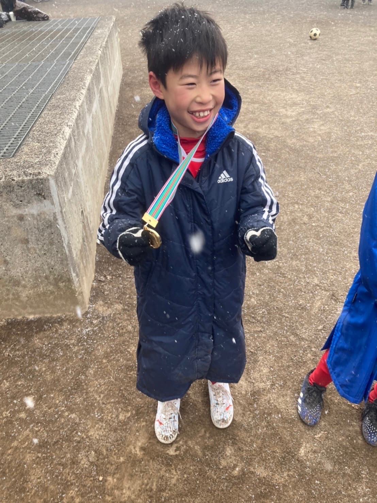

## 日時・会場

2022年1月6日（木） 
@妙正寺川公園運動場

### 予選リーグ（20分1本）

| 対戦相手| スコア |   | 得点者  |
|:----|:------:|:-:|:--------|
| FCとんぼ | 0-0 | △ |-|
| 鶴牧SC | 0-3 | × |-|
| エルフシュリット品川 | 0-1 | × |-|

### 順位決定戦（12分ハーフ）

| 対戦相手| スコア |   | 得点者  |
|:----|:------:|:-:|:--------|
| わかみやサッカー少年団 | 1-0 | 〇 |たかりん|

成績：7位/8チーム中 
優秀選手：はぎはら　れお

関係者の皆様、ありがとうございました。