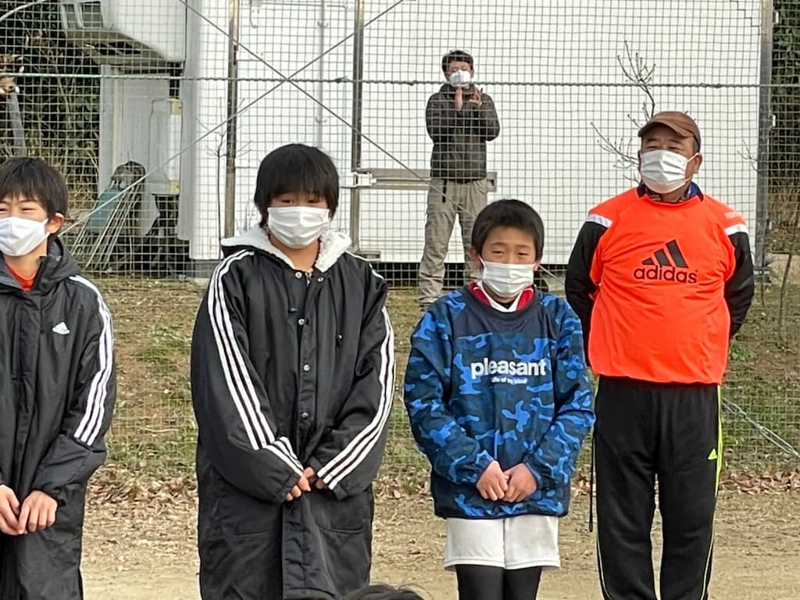

## 日時・会場

2022年1月10日（月） 
8人制20分ハーフ 
@流山スポーツフィールド

| 対戦相手| スコア |   | 得点者  |
|:----|:------:|:-:|:--------|
| 金町SC | 2-0 | 〇 |りと、しゅうと|
| 明海FC | 3-0 | 〇 |たろう、しゅうと、りと|
| ペガサスJFC | 1-1 | △ |たろう|
| サンエフ葛西SC | 2-0 | 〇 |しゅうと2|

成績：Aリーグ準優勝  
優秀選手賞：おき　そうすけ  
　　　　　　にしやま　ふくりん

関係者の皆様、ありがとうございました。