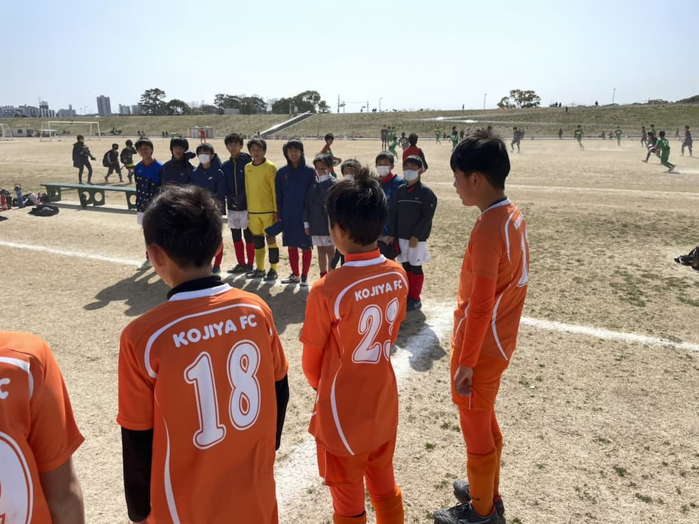

## 日時・会場

2022年3月5日（土）08:00キックオフ  
8人制12分ハーフ 5チーム総当たり 
@篠崎グランド　イ面

### エスブランコA（6年生）

| 対戦相手| スコア |   |
|:----|:------:|:-:|
| FCログロ | 0-4 | × |
| ブルーイーグルスFC| 0-1 | × |
| 古千谷FC | 2-0 | ○ |
| FCエスブランコB | 3-2 | ○ |

### エスブランコB（5年生）

| 対戦相手| スコア |   |
|:----|:------:|:-:|
| 古千谷FC | 0-2 | × |
| ブルーイーグルスFC| 0-4 | × |
| FCログロ | 3-1 | ○ |
| FCエスブランコA | 2-3 | ×|

### 結果

（全4チーム）  
FCエスブランコA 3位  
FCエスブランコB 4位  

関係者の皆様、ありがとうございました。