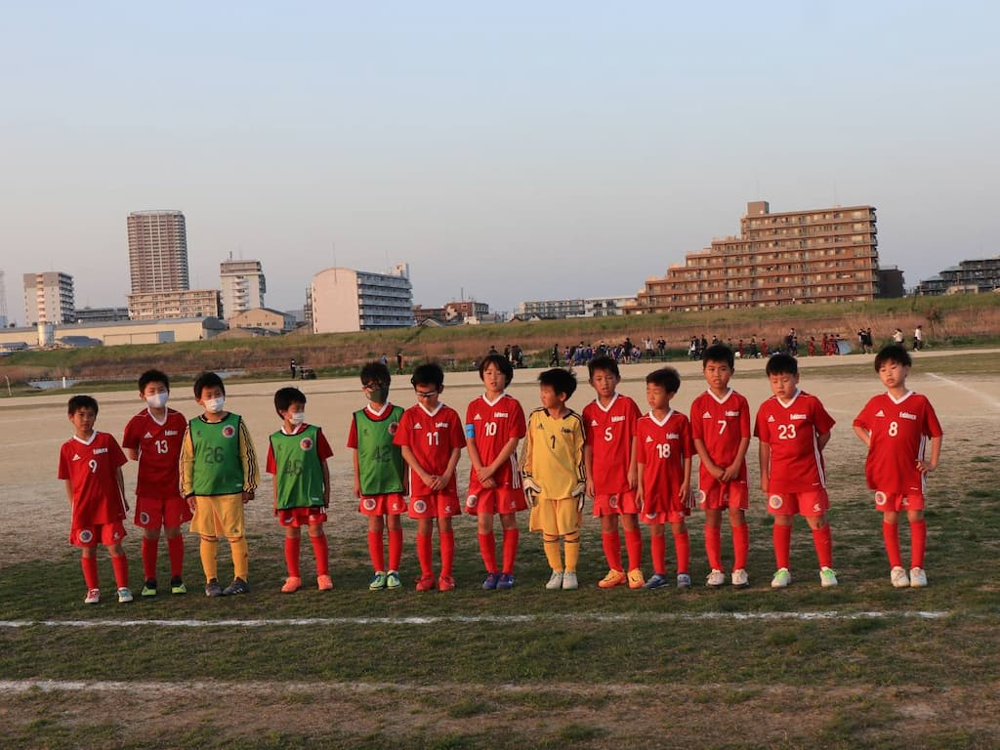

## 日時・会場

2022年4月10日（日）15:00キックオフ 
8人制20分ハーフ 
@篠崎グランド　イ面

### 1回戦

| 対戦相手| スコア |   | 得点者  |
|:----|:------:|:-:|:--------|
| レオーネSC | 5-1 (前半3-1) | 〇 |はやと2、れお、こうたろう、よしなり|

### 2回戦

| 対戦相手| スコア |   | 得点者  |
|:----|:------:|:-:|:--------|
| FC DIOS | 1-5 (前半0-5) | × |まさき|

関係者の皆様、ありがとうございました。
