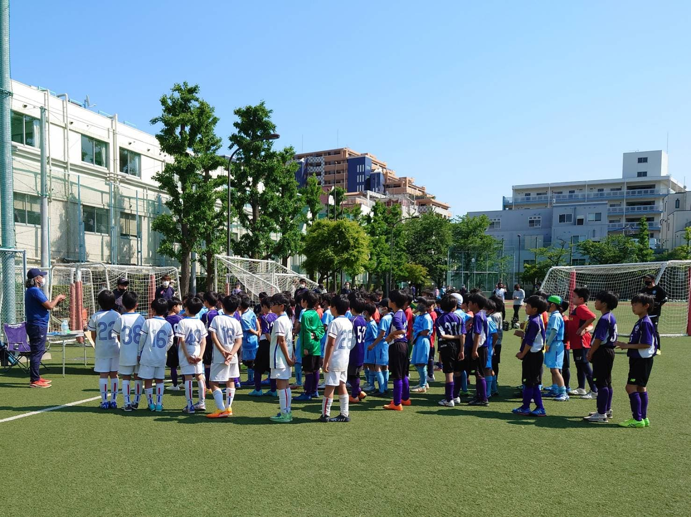

## 日時・会場

2022年5月3日（火） 
@鮫洲運動公園

### 予選リーグ（8人制12分ハーフ）

| 対戦相手| スコア |   | 得点者  |
|:----|:------:|:-:|:--------|
| エルフシュリット品川 | 1-0 | 〇 |ゆうわ|
| FCトリアネーロ町田 | 1-10 （前半0-5） | × |はるひと|

### 順位決定戦（8人制15分ハーフ）

| 対戦相手| スコア |   | 得点者  |
|:----|:------:|:-:|:--------|
| FC中原 | 2-2 （前半2-0） PK2-3 | × |よしなり、OG|

成績：4位/6チーム中 

関係者の皆様、ありがとうございました。