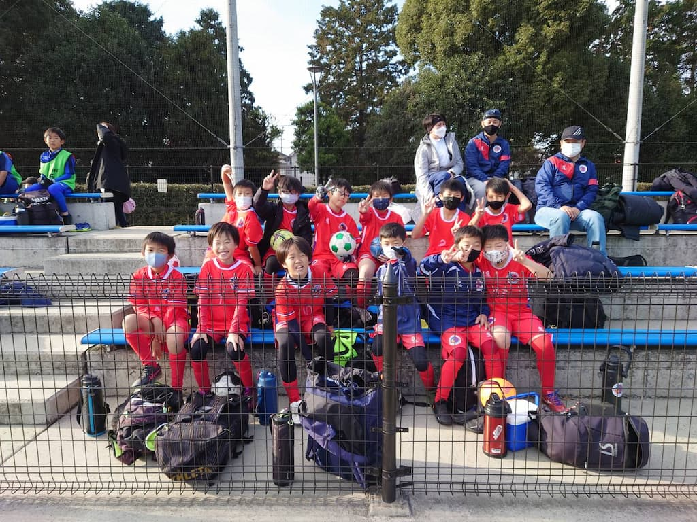

## 日時・会場

2022年12月11日（日） 
@所沢航空記念公園サッカー場

### 予選リーグ（8人制12分）

| 対戦相手| スコア |   | 得点者  |
|:----|:------:|:-:|:--------|
| Una Primavera FC ブルー | 0-0 | △ |-|
| FC小田原 | 0-1 | × |-|
| TokyoDreamFC | 1-0 | 〇 |ゆうわ|

### 順位決定トーナメント（8人制15分ハーフ）

| 対戦相手| スコア |   | 得点者  |
|:----|:------:|:-:|:--------|
| FCアベリア | 0-2 （前半0-1） | × |-|
| 高島平SC | 0-1 （前半0-1） | × |-|

成績：8位/16チーム中 
優秀選手：くぼた　はるひと 

関係者の皆様、ありがとうございました。