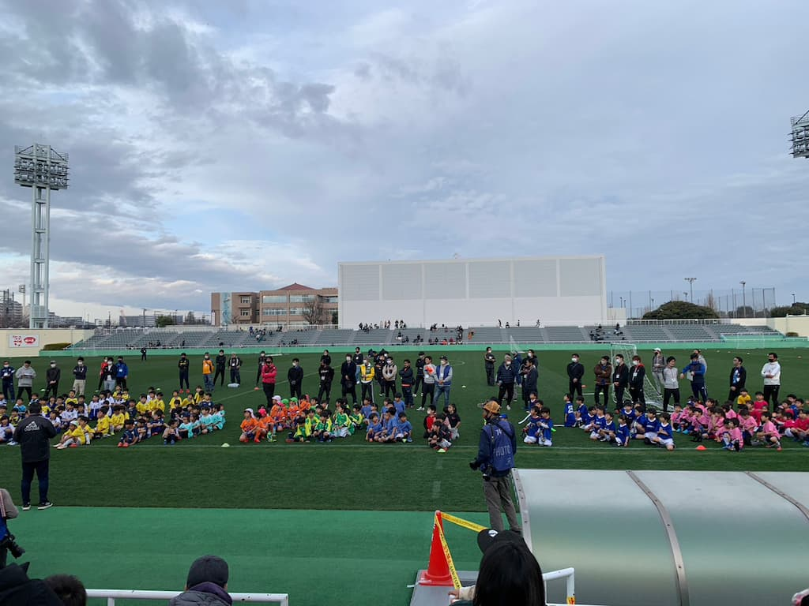

## 日時・会場

2023年2月19日（日）14:00キックオフ 
8人制8分 
@味の素フィールド西が丘

| 対戦相手| スコア |   | 得点者  |
|:----|:------:|:-:|:--------|
| ヴィルトゥスSC | 1-2 | × |みなと|
| バディSC世田谷ブルー | 0-3 | × |-|
| 目白ジュニアSC B | 5-1 | 〇 |みなと3、きょうご、そらいち|

成績：Aグループ　3位/4チーム中

関係者の皆様、ありがとうございました。