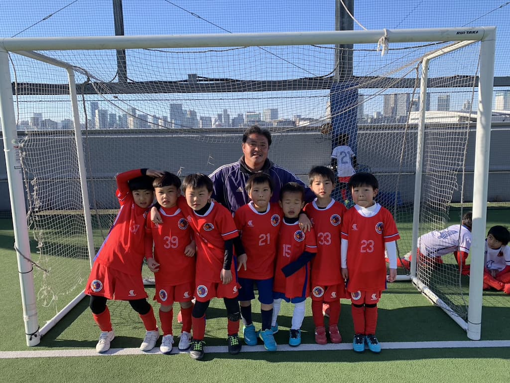

## 日時・会場

2023年2月26日（日）11:00キックオフ 
6人制15分ハーフ 
@BUDDYスポーツアリーナ

### FCエスブランコ①

#### 予選Aグループ

| 対戦相手| スコア |   | 得点者  |
|:----|:------:|:-:|:--------|
| バディSC江東ブルー | 2-4 （前半2-2） | × |はるく、みなと|
| 横浜すみれSC | 0-13 （前半0-8） | × |-|

#### 下位リーグ

| 対戦相手| スコア |   | 得点者  |
|:----|:------:|:-:|:--------|
| バディSC江東ホワイト | 2-8 （前半2-4） | × |そら2|
| FCエスブランコ② | 8-5 （前半2-4） | × |そら5、はるく2、とわ|

成績：5位/6チーム中 

### FCエスブランコ②

#### 予選Bグループ

| 対戦相手| スコア |   | 得点者  |
|:----|:------:|:-:|:--------|
| バディSC江東ホワイト | 1-1 （前半0-1） | △ |そうすけ|
| シルクロードSC | 0-8 （前半0-2） | × |-|

#### 下位リーグ

| 対戦相手| スコア |   | 得点者  |
|:----|:------:|:-:|:--------|
| FCエスブランコ① | 5-8 （前半4-2）| × |そな3、そうすけ、はじめ|
| バディSC江東ホワイト | 1-3 （前半0-2） | × |そな|

成績：6位/6チーム中 

関係者の皆様、ありがとうございました。