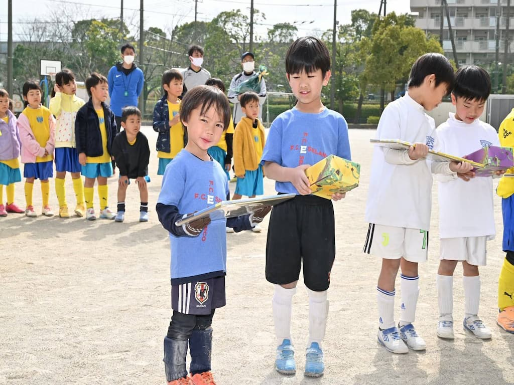

## 日時・会場

2023年3月5日（日）9:20キックオフ 
6～8人制7分ハーフ 
@南葛西第三小学校

### 予選リーグ

| 対戦相手| スコア |   | 得点者  |
|:----|:------:|:-:|:--------|
| FC85ネイビー | 0-2 | × |-|
| 一之江キッカーズ | 7-0 | 〇 |みなと5、あさひ、きょうご|
| 清新第三SC | 1-1 | △ |みなと|
| えどそらレッド | 0-3 | × |-|

### 順位決定戦

| 対戦相手| スコア |   | 得点者  |
|:----|:------:|:-:|:--------|
| えどそらグリーン| 0-1 | × |-|

成績：6位/10チーム中  
優秀選手：あさひ、れおん

関係者の皆様、ありがとうございました。