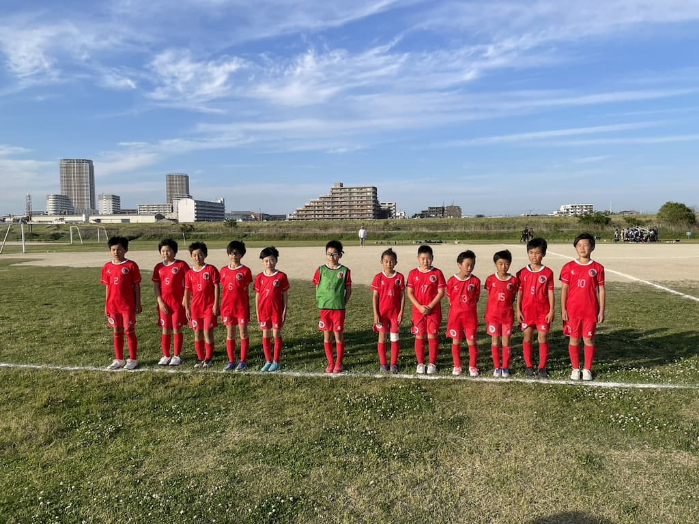

## 日時・会場

2023年5月3日（水）14:30キックオフ 
@篠崎グランド  ハ面

### 公式戦（8人制15分ハーフ）　

| 対戦相手| スコア |   | 得点者  |
|:----|:------:|:-:|:--------|
| FCレパードジュニア| 2-1 （前半2-0） | 〇 |はやと2|

### フレンドリーマッチ（8人制15分）　

| No.| スコア |   | 得点者  |
|:--:|:------:|:-:|:--------|
| 1  | 0-0 | △ |-|
| 2  | 3-0 | 〇 |はるひと2、OG|
| 3  | 0-2 | × |-|
| 4  | 0-0 | △ |-|
| 5  | 2-1 | 〇 |はやと|
| 6  | 1-2 | × |まさき|

FCレパードジュニア の皆様、ありがとうございました。