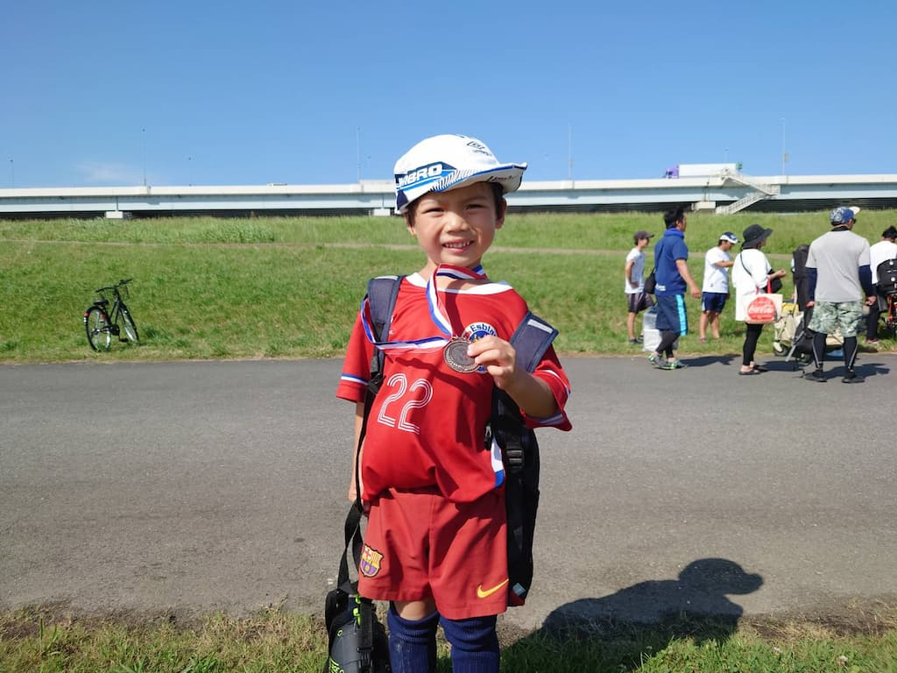

## 日時・会場

2023年7月2日（日）12:40キックオフ 
8人制15分 
@木根川橋球技場

### 予選リーグ

| 対戦相手| スコア |   | 得点者  |
|:----|:------:|:-:|:--------|
| FC深川レインボーズ| 0-2 | × |-|
| 清和イレブンSC| 4-2 | 〇 |あさひ、きょうご、みなと2|
| FC R.E.V.| 1-2 | × |きょうご|

### 3位決定戦

| 対戦相手| スコア |   | 得点者  |
|:----|:------:|:-:|:--------|
| 清和イレブンSC| 3-0 | 〇 |みなと2、きょうご|

成績：3位/4チーム中  
MVP：すずき　あさひ

関係者の皆様、ありがとうございました。