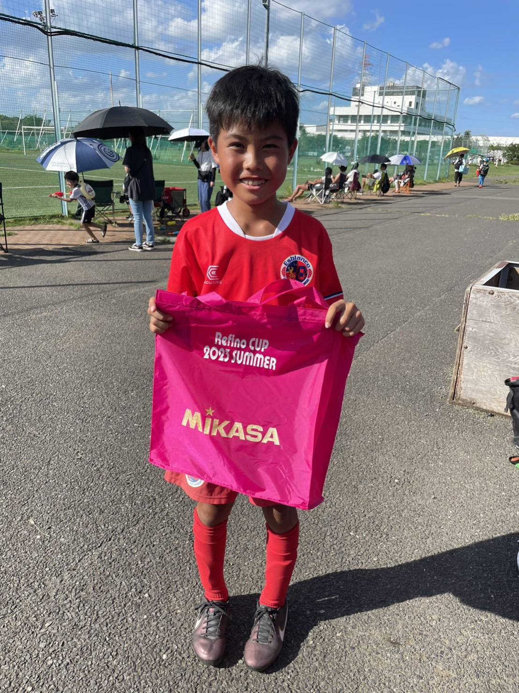

## 日時・会場

2023年8月11日（金） 
@清瀬市内山運動公園サッカー場 C面

### 予選リーグ（8人制12分ハーフ）

| 対戦相手| スコア |   | 得点者  |
|:----|:------:|:-:|:--------|
| FC Fusabio | 4-0 （前半2-0） | 〇 |ゆうわ2、まさき、れお|
| FCアビリスタ | 0-4 （前半0-0） | × |-|

予選リーグ2位通過

### 順位決定戦（8人制15分ハーフ）

| 対戦相手| スコア |   | 得点者  |
|:----|:------:|:-:|:--------|
| Refino 87 | 2-0 （前半1-0） | 〇 |はるひと、まさき|
| FC Gois | 1-4 （前半0-2） | × |かんた|

成績：6位/12チーム中 
MIP：やすかわ　まさき 

関係者の皆様、ありがとうございました。