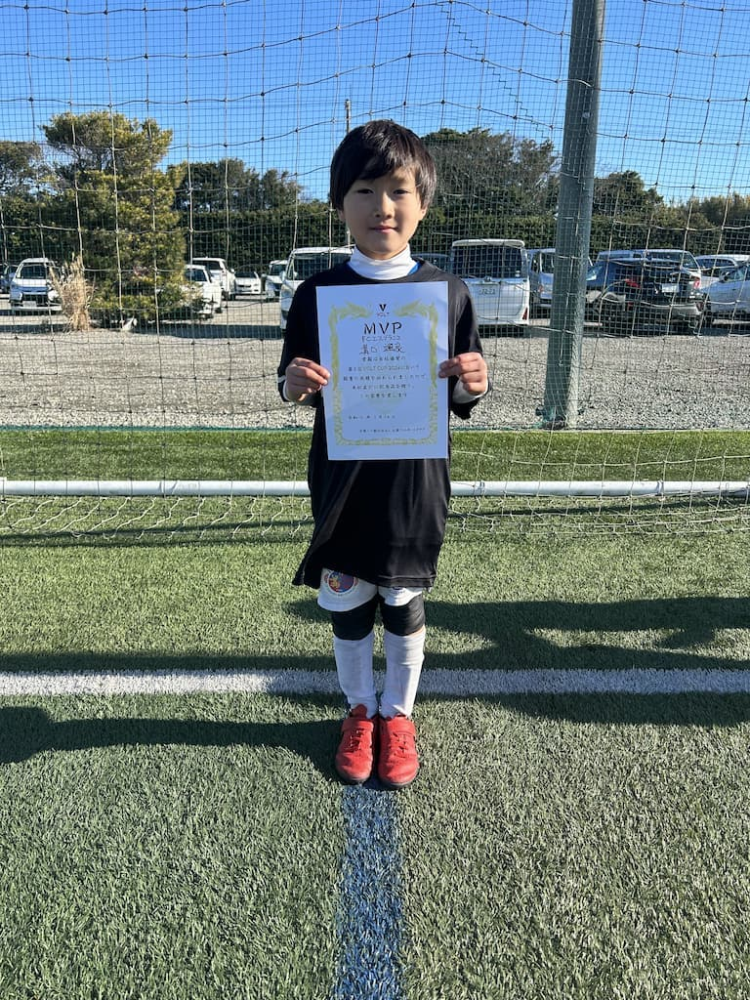

## 日時・会場

2024年1月13日（土）～14日（日） 
@茨城県波崎ジャーニィー若松グラウンド 
8人制12分ハーフ

### 予選リーグ

| 対戦相手| スコア |   | 得点者  |
|:----|:------:|:-:|:--------|
| 大森FC Green | 0-6 | × |-|
| FC.Logro | 0-9 | × |-|
| ペラーダジュニアーズ(B) | 2-6 | × |そら2|

### Bリーグ（9～12位決定戦）

| 対戦相手| スコア |   | 得点者  |
|:----|:------:|:-:|:--------|
| ペラーダジュニアーズ(A) | 3-1 | 〇 |そら2、OG|
| 大森FC White | 1-0 | 〇 |そら|
| 息栖SSS | 2-2 | △ |そら、みなと|

成績：Bリーグ 1位/4チーム中 
最終成績：9位/12チーム中 
MVP（チーム選出）：みぞぐち　そら 

### フレンドリーマッチ

| 対戦相手| スコア |   | 得点者  |
|:----|:------:|:-:|:--------|
| ペラーダジュニアーズ(A) | 0-1 | × |-|
| 息栖SSS | 0-0 | △ |-|

関係者の皆様、ありがとうございました。