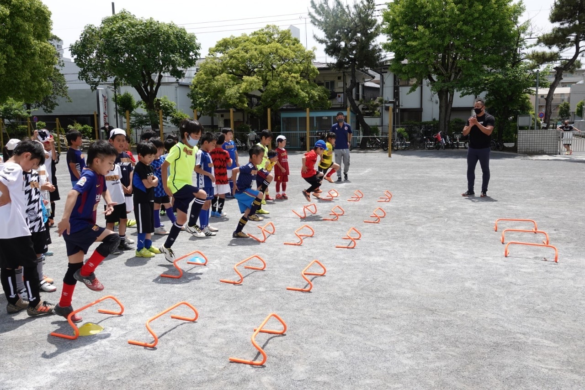
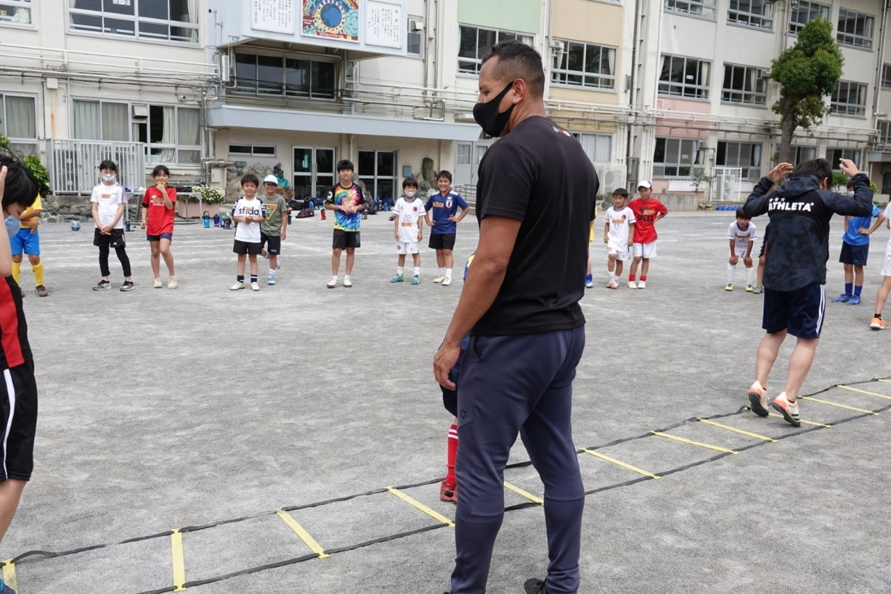
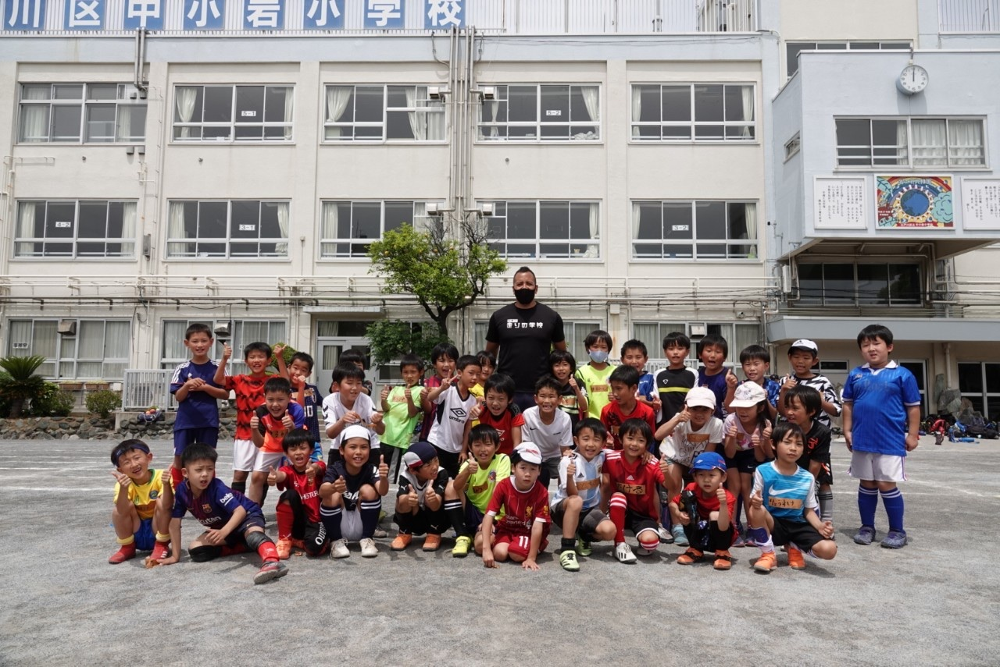

FC Esblancoは、[走りの学校](https://www.hashiri.school)から錵都 カルロス リカルド(Nieto RICARDO Calros)さんをお招きして『走りの学校』第1回講習会』を開催しました。

##  走りの学校とは？
走りの学校とは、短距離を速く走るために必要な「スプリントテクニック」の習得にフォーカスした独自のメソッドを持つオンラインとオフラインのスクールとなります。

選手達は、戸惑いながらも一生懸命受講し、普段学ぶ事のない正しい走り方を学ぶ良い機会となりました。

## 今後について
今後は、数ヶ月に一度のタイミングで【走りの学校 講習会】を予定しております。

FC Esblancoは、サッカーの基礎技術も学び、サッカーを取り巻く環境の中で、様々な側面での選手の成長をサポートいたします。

#### 暑い夏を乗り越えよう
<iframe style="width:120px;height:240px;" marginwidth="0" marginheight="0" scrolling="no" frameborder="0" src="https://rcm-fe.amazon-adsystem.com/e/cm?ref=tf_til&t=esb0c-22&m=amazon&o=9&p=8&l=as1&IS1=1&detail=1&asins=B0973DY9H6&linkId=62bb76d6778e9fcb8057a314066bf43d&bc1=ffffff&amp;lt1=_blank&fc1=333333&lc1=0066c0&bg1=ffffff&f=ifr">
    </iframe>
<iframe style="width:120px;height:240px;" marginwidth="0" marginheight="0" scrolling="no" frameborder="0" src="https://rcm-fe.amazon-adsystem.com/e/cm?ref=tf_til&t=esb0c-22&m=amazon&o=9&p=8&l=as1&IS1=1&detail=1&asins=B095CGMDRB&linkId=99ac6006db5111846fd42985d8c50e73&bc1=ffffff&amp;lt1=_blank&fc1=333333&lc1=0066c0&bg1=ffffff&f=ifr">
    </iframe>
<iframe style="width:120px;height:240px;" marginwidth="0" marginheight="0" scrolling="no" frameborder="0" src="https://rcm-fe.amazon-adsystem.com/e/cm?ref=tf_til&t=esb0c-22&m=amazon&o=9&p=8&l=as1&IS1=1&detail=1&asins=B0939KZKX4&linkId=786652c0557f81066c90eecc24c592d3&bc1=ffffff&amp;lt1=_blank&fc1=333333&lc1=0066c0&bg1=ffffff&f=ifr">
    </iframe>    