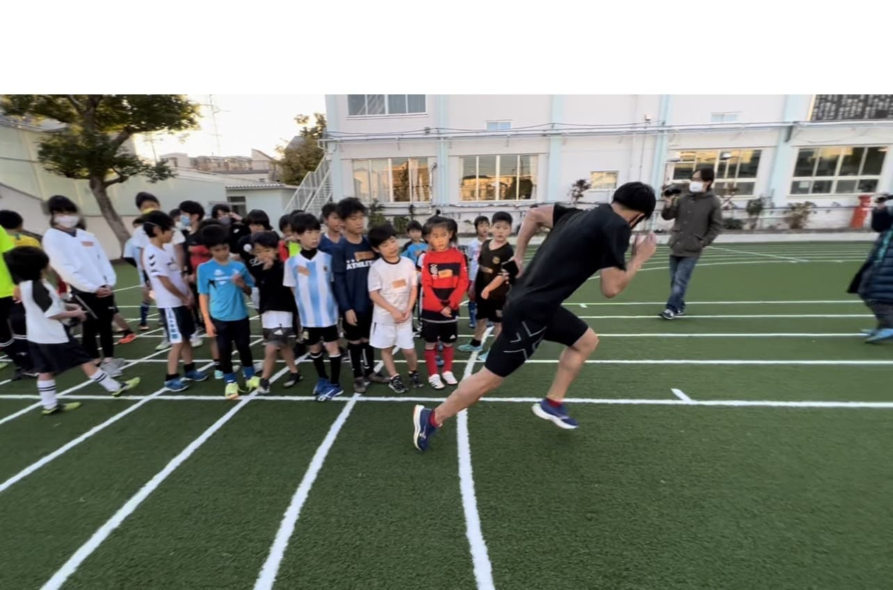

FC Esblancoは、第二回「走りの学校講習会」を実施しました。

第二回の講師は『外川 天寿』先生です。
外川先生は、現役の走り幅跳びのJAAF強化指定選手で、走り幅跳び8メートル、100メートル走 10秒40  50メートル走 5秒72の記録を持っております。

本日のテーマは『スタートダッシュ』です。
前半は、前回の振り返りをしつつ、『スタートダッシュ』のコツや姿勢を教えて頂きました。

『スタートダッシュ』のコツは、壁に両手をつけて、前傾姿勢をとります。
前傾姿勢のスタートからベストポジションへの姿勢の変化などを学びました。

選手達は、戸惑いながらも一生懸命受講し、普段学ぶ事のない正しい走り方を学ぶ良い機会となりました。

FC Esblancoは、サッカーの基礎技術も学び、サッカーを取り巻く環境の中で、様々な側面での選手の成長をサポートいたします。

